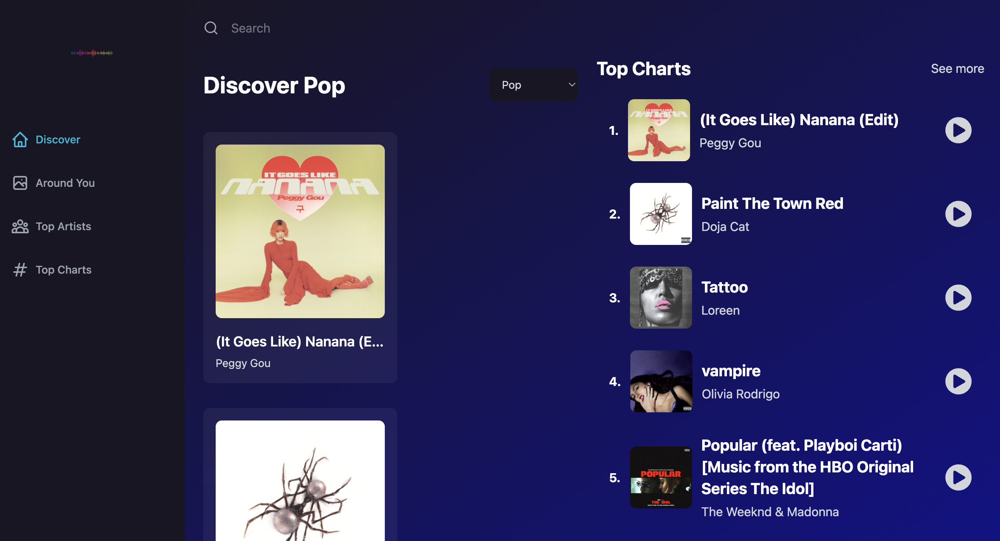

# React Spotify Clone App

This is a Spotify clone app built with React that utilizes the Rapid API to provide users with access to the most popular tracks and artists. The app focuses on a specific country and genre of music to deliver a tailored music experience.

## Features
- 🎵 **Music Discovery**: Discover the most popular tracks and artists in your chosen country and genre of music.
- 🔄 **Real-Time Data**: The app uses the Rapid API to fetch real-time data, ensuring that you stay updated with the latest trends.
- 📱 **Responsive Design**: Enjoy a seamless experience on both desktop and mobile devices.
- 🔐 **User Authentication**: Log in with your Spotify account to access additional features (coming soon).

## Technologies Used
- ⚛️ **React\Next.js**: The app is built using React, a popular JavaScript library for building user interfaces.
- 🚀 **Rapid API**: Rapid API is used to access music data and enhance the user experience.
- 🌐 **HTML & CSS**: The app's layout and styling are done using HTML and CSS.
- 🔥 **Firebase (Coming Soon)**: User authentication and additional features will be implemented using Firebase.

Screenshot of local version:
